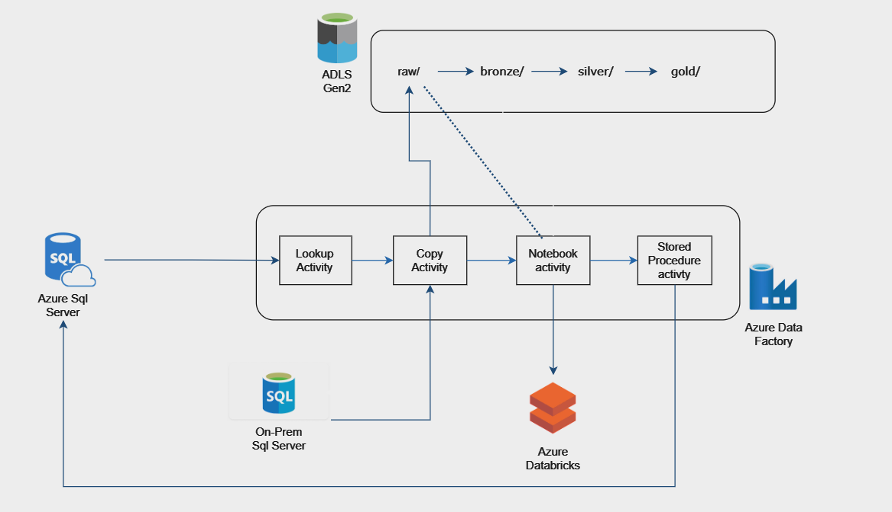

# Retailer Data Analytics | Modern Data Engineering Azure Project

## Introduction
The objective of this project is to design and implement a scalable data pipeline using Azure Cloud. The pipeline ingests multiple source tables from an on-premises SQL Server and loads them into Azure Data Lake Storage Gen2 (ADLS Gen2). Leveraging the medallion architecture, the pipeline processes and transforms the ingested data through bronze, silver, and gold layers. The refined data stored in the gold layer is optimized for reporting and analytics purposes, ensuring high-quality insights for business use cases.

## Architecture

## Technology Used
1. Programing Language - Python
2. Scripting Language - SQL
3. Azure CLoud services
   - Azure DataFactory (ADF)
   - Azure Datalake Gen2 (ADLS)
   - Azure Databricks
   - Azure Keyvault
   - Azure Sqlserver
4. Apache Spark
   - PySpark
   - Spark SQL
5. Source DB - On-Prem SQL Sever

## Sample Data Used
The source data resides in an on-premises SQL Server and comprises multiple tables, including reviews, products, customers, and categories. Each table contains a date column that indicates the specific day when the corresponding record was generated.

[Sample data file](sample_data.txt)

## SQL and Python Scripts
### Source Table creation Scripts
[reviews table](reviews.sql)

[products table](products.sql)

[categories table](categories.sql)

[customers table](customers.sql)

### Control Table Script
[control table](control_table.txt)
### Stored Procedure Script
[stored procedure](stored_procedure.txt)
### Azure Databricks Notebook
[Transformation notebook file](retail_data_ingestion.ipynb)
